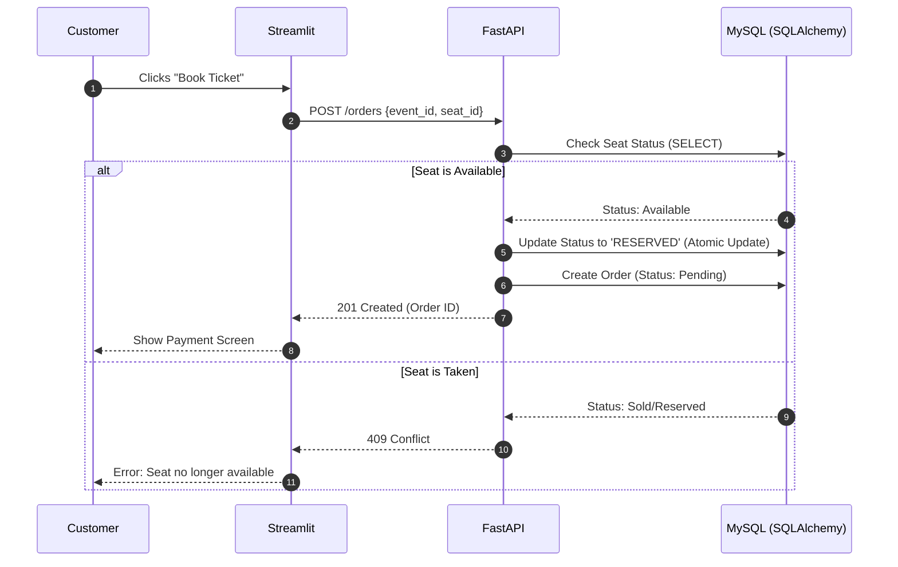

"# online-event-ticket-booking-platform" 

```mermaid
sequenceDiagram
    autonumber
    participant U as Customer
    participant S as Streamlit
    participant A as FastAPI
    participant D as MySQL (SQLAlchemy)

    U->>S: Clicks "Book Ticket"
    S->>A: POST /orders {event_id, seat_id}
    A->>D: Check Seat Status (SELECT)
    alt Seat is Available
        D-->>A: Status: Available
        A->>D: Update Status to 'RESERVED' (Atomic Update)
        A->>D: Create Order (Status: Pending)
        A-->>S: 201 Created (Order ID)
        S-->>U: Show Payment Screen
    else Seat is Taken
        D-->>A: Status: Sold/Reserved
        A-->>S: 409 Conflict
        S-->>U: Error: Seat no longer available
    end
```
