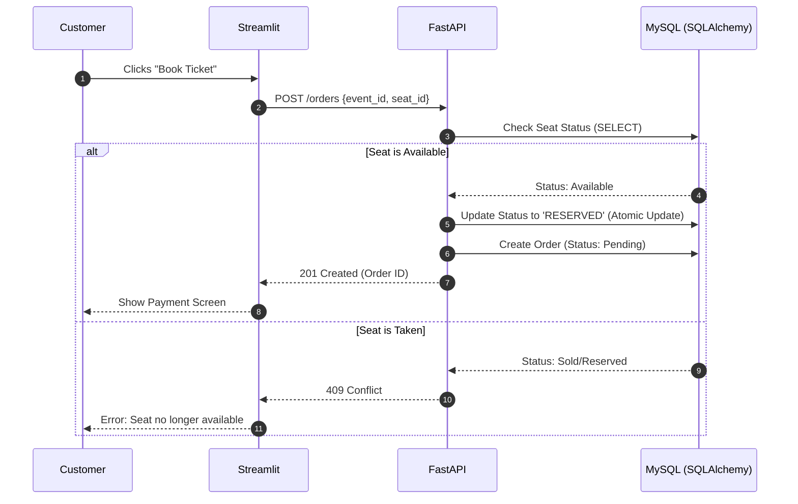

"# online-event-ticket-booking-platform" 


## Run Locally

### Backend (FastAPI)
1. Install dependencies:
```
pip install -r requirements.txt
```
2. Start the API:
```
uvicorn backend.main:app --reload
```

### Frontend (Streamlit)
1. In a new terminal, run:
```
streamlit run frontend/app.py
```

### Notes
- Default API base URL is `http://127.0.0.1:8000`.
- You can override it with `API_BASE_URL` environment variable.
