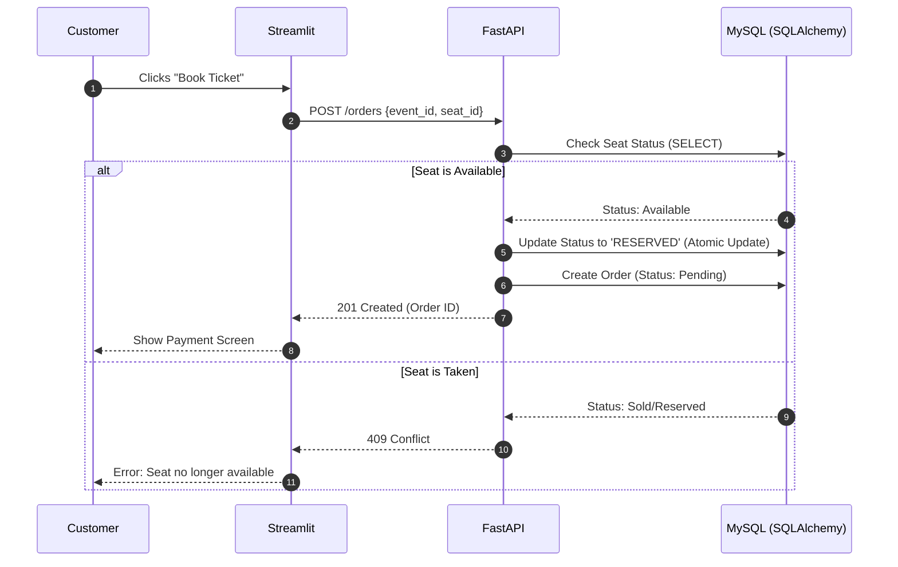

# 🎫 Online Event Ticket Booking Platform

A full-stack, real-time event ticketing system built for high performance and reliability. This platform allows users to browse events and book seats with atomic transaction handling to prevent double-booking, while providing specialized dashboards for admins, organizers, and entry managers.

## 🚀 Tech Stack

* **Frontend**: [Streamlit](https://streamlit.io/) (Interactive Dashboard & UI)
* **Backend**: [FastAPI](https://fastapi.tiangolo.com/) (High-performance Python API)
* **Database**: [MySQL](https://www.mysql.com/) with [SQLAlchemy ORM](https://www.sqlalchemy.org/)
* **Authentication**: [JWT (JSON Web Tokens)](https://jwt.io/) with `python-jose` and `passlib`
* **Data Validation**: [Pydantic](https://docs.pydantic.dev/) for structured data schemas

## 🔄 Core Booking Workflow

The system uses an atomic update strategy to ensure seat integrity during high-traffic booking sessions.


## ✨ Key Features
### 👤 User Roles
#### Customer: Browse upcoming events, select seats, and manage bookings.

#### Organizer: Create events and manage seat allocations.

#### Admin: Full system oversight, including venue management and user roles.

#### Entry Manager: Real-time ticket validation at the venue using unique Ticket IDs.

#### Support: Handle refund requests and customer service cases.

## 🛠 Technical Highlights
#### Concurrency Control: Uses SQLAlchemy's with_for_update() to lock seat rows during transactions, preventing race conditions.

#### Modular Architecture: Clean separation of concerns with dedicated Routers, Services, and Schemas.

#### JWT Security: Secure login and role-based access control (RBAC) implemented via FastAPI dependencies.

## 📂 Project Structure
```
├── backend/
│   ├── models/       # SQLAlchemy Database Models (User, Event, Seat, etc.)
│   ├── routers/      # API Endpoints (Auth, Booking, Support, etc.)
│   ├── schemas/      # Pydantic Data Validation Models
│   ├── services/     # Business Logic & DB Transactions
│   ├── utils/        # Security, Hashing, and JWT Helpers
│   ├── main.py       # FastAPI Entry Point
│   └── database.py   # DB Engine & Session Configuration
├── frontend/
│   ├── pages/        # Streamlit Multi-page Dashboards
│   ├── api_handler.py# Frontend-to-Backend API calls
│   └── app.py        # Streamlit Main Entry Point
└── requirements.txt  # Project Dependencies
```
## 🛠 Installation & Setup
#### Clone the repository

#### Set up a Virtual Environment:

```
python -m venv .venv
source .venv/bin/activate  # Windows: .venv\Scripts\activate
```
### Install Dependencies:

```
pip install -r requirements.txt
```
 ### Database Configuration:

#### Ensure MySQL is running.

#### Update DATABASE_URL in backend/database.py with your credentials.

### Run the Backend:

```
uvicorn backend.main:app --reload
```
### Run the Frontend:

```
streamlit run frontend/app.py
```
## 🔗 Design Links
```
Database ERD: dbdiagram.io/d/699d5463bd82f5fce29e2fb2

Workflow Diagram: mermaid.ai/d/5ae1a3f4-9ffb-4fe4-aaa0-d55e557dd004
```
